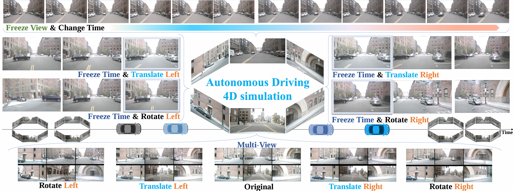
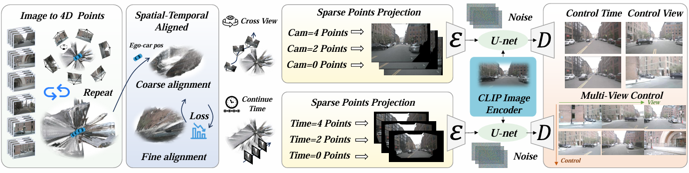

# Stag: Towards Realistic 4D Driving Simulation with Video Generation Model

### [Paper](https://arxiv.org/abs/2405.20337)  | [Project Page](https://wzzheng.net/Stag) 


> Stag: Towards Realistic 4D Driving Simulation with Video Generation Model

**[Lening Wang](https://github.com/LeningWang)**\* $^1$, **[Wenzhao Zheng](https://wzzheng.net/)\* $\dagger$**, **[Dalong Du](https://www.phigent.ai/aboutus)**, **[Yunpeng Zhang](https://scholar.google.com/citations?user=UgadGL8AAAAJ&hl=en&oi=ao)**, **[Yilong Ren](https://shi.buaa.edu.cn/renyilong/zh_CN/index.htm)**, **[Han Jiang](https://scholar.google.com/citations?user=d0WJTQgAAAAJ&hl=zh-CN&oi=ao)**, **[Zhiyong Cui](https://zhiyongcui.com/)**, **[Haiyang Yu](https://shi.buaa.edu.cn/09558/zh_CN/index.htm)**, **[Jie Zhou](https://www.au.tsinghua.edu.cn/info/1084/1699.htm)** , **[Jiwen Lu](http://ivg.au.tsinghua.edu.cn/Jiwen_Lu/)**, **[Shanghang Zhang](https://www.shanghangzhang.com/)**

$^1$ State Key Lab of Intelligent Transportation System, Beihang University, China  
$^2$ EECS, UC Berkeley, United States  
$^3$ Department of Automation, Tsinghua University, China  
$^4$ PhiGent Robotics  
$^5$ State Key Laboratory of Multimedia Information Processing, School of Computer Science, Peking University, China  


Contact: [leningwang@buaa.edu.cn](mailto:leningwang@buaa.edu.cn), [wenzhao.zheng@outlook.com](mailto:wenzhao.zheng@outlook.com)

\* Equal contribution $\dagger$ Project leader


## News

- **[2024/12/4]** Part of the code release.
- **[2024/12/5]** Paper released on [arXiv](https://arxiv.org/abs/).


## Demo

### 4D Driving Simulation:


## Overview


Spatial-Temporal simulAtion for drivinG (Stag) enables controllable 4D autonomous driving simulation with spatial-temporal decoupling. Stag can decompose the original spatial-temporal relationships of real-world scenes to enable controllable autonomous driving simulation. This allows for adjustments such as fixing the camera viewpoint while advancing time or translating and rotating space while keeping time stationary. Additionally, Stag maintains synchronized variations across six panoramic views.




Our Stag framework is a 4D generative model for autonomous driving simulation. It reconstructs 4D scenes from point clouds and projects them into continuous, sparse keyframes. A spatial-temporal fusion framework is then used to generate simulation scenarios. Two key design aspects guide our approach: 1) We develop a method for 4D point cloud matching and keyframe reconstruction, ensuring the accurate generation of continuous, sparse keyframes that account for both vehicle motion and the need for spatial-temporal decoupling in simulation. 2) We build a spatial-temporal fusion framework that integrates surround-view information and continuous scene projection to ensure accurate simulation generation.
## Getting Started

### Installation
1. Create a conda environment with Python version 3.8.18

2. Install all the packages in environment.yaml


### Preparing

We prepare the nuScenes dataset similar to [MagicDrive](https://github.com/cure-lab/MagicDrive). 

1. Download the nuScenes dataset from the [website](https://www.nuscenes.org/nuscenes) and put them in `./data/`. You should have these files:
    ```bash
    data/nuscenes
    ├── maps
    ├── mini
    ├── samples
    ├── sweeps
    ├── v1.0-mini
    └── v1.0-trainval

   
   
### Training / Fine-tuning

```
sh configs/run-our/run.sh
```
## Related Projects

Our code is based on [ViewCrater](https://github.com/Drexubery/ViewCrafter) and [MagicDrive](https://github.com/cure-lab/MagicDrive). 

Also thanks to these excellent open-sourced repos:
[Vista](https://github.com/OpenDriveLab/Vista)  and [S<sup>3</sup>Gaussian](https://github.com/nnanhuang/S3Gaussian)


## Citation

If you find this project helpful, please consider citing the following paper:
```
  @article{wang2024stag,
    title={Stag: Towards Realistic 4D Driving Simulation with Video Generation Model},
    author={Wang, Lening and Zheng, Wenzhao and Ren, Yilong and Jiang, Han and Cui, Zhiyong and Yu, Haiyang and Lu, Jiwen},
    journal={arXiv preprint arXiv:},
    year={2024}
	}
```